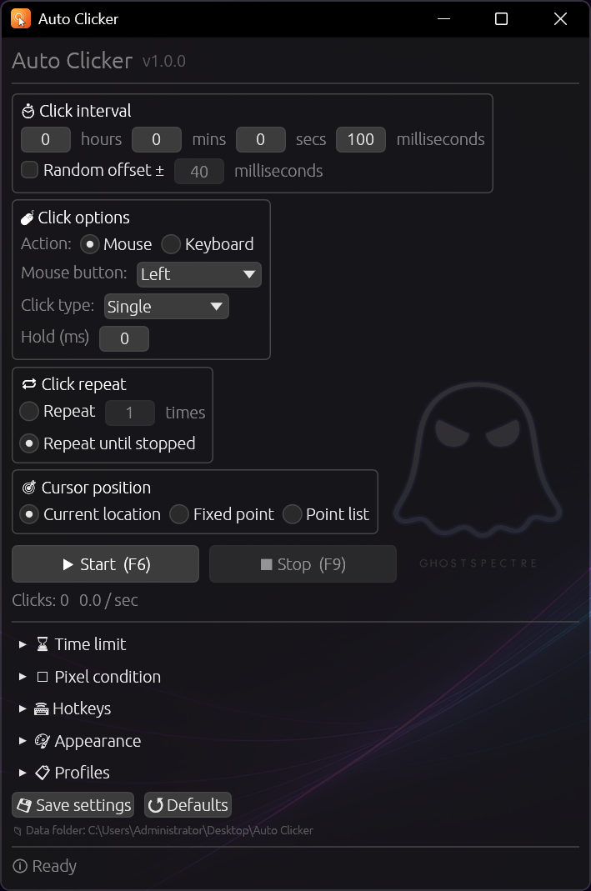
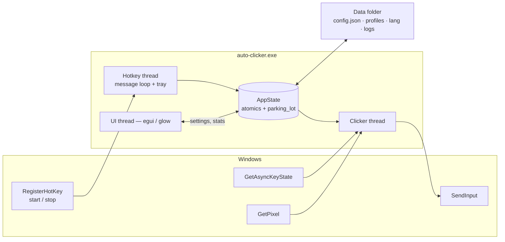
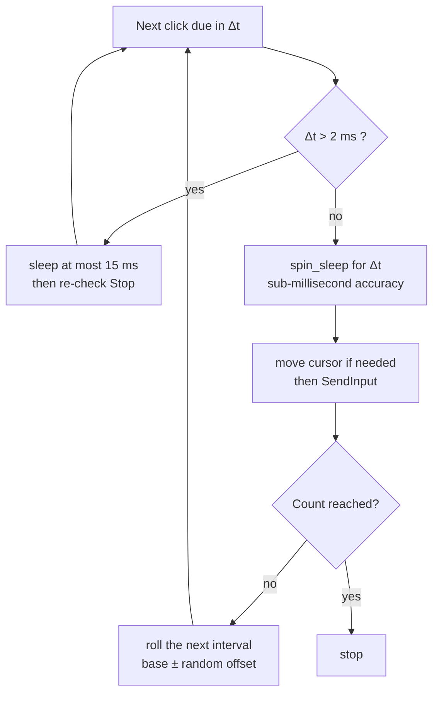
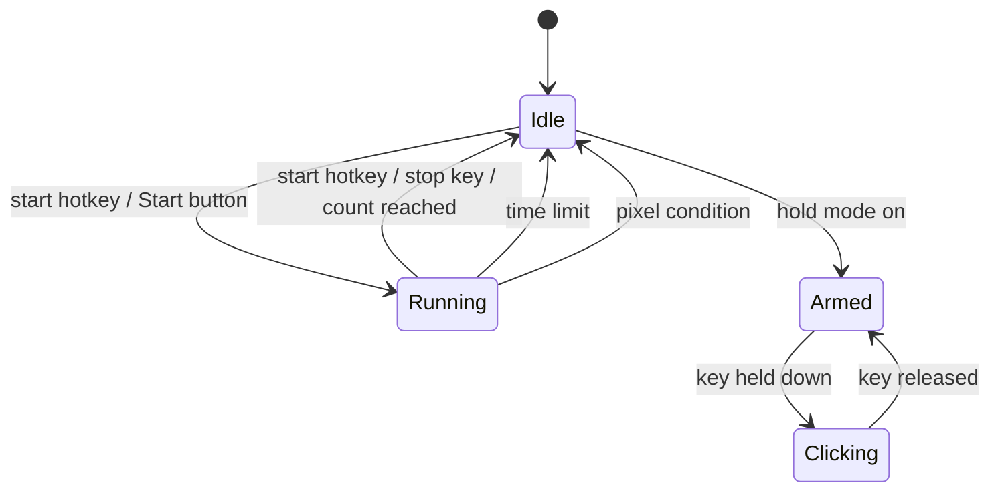

<div align="center">


# 🖱 Auto Clicker

**An open-source take on OP Auto Clicker — written in Rust.**
*The same layout you already know, with the parts that were always missing.*

[](LICENSE)
[]()
[]()
[]()
[](https://github.com/blackixxce12/AutoClicker/releases/tag/clicker)

*Set an interval → pick a button → press `F6` → go do something else.*

[📥 Download](../../releases) • [✨ Features](#-features) • [🆚 vs OP Auto Clicker](#-auto-clicker-vs-op-auto-clicker) • [🧠 How it works](#-how-it-works) • [🇷🇺 Русская версия](README_RU.md)



</div>

---

## 🆕 Highlights

| | |
|---|---|
| ⏱ **The interval you expect** | Hours / minutes / seconds / milliseconds, with an optional random ± offset — defaults identical to OP Auto Clicker |
| ⌨ **Keyboard mode** | Repeat a *key* instead of a click, on the same schedule. Sent by scancode, so raw-input games see it |
| 🔫 **Hold to click** | The start key becomes a trigger: clicks happen only while you hold it |
| 📍 **Point list** | Cycle through as many screen points as you like, not just one |
| 🎲 **Pixel spread** | Random offset in pixels around the target, so the clicks aren't machine-perfect |
| 🌡 **Pixel stop condition** | Watch one screen pixel and stop when its colour changes — pick it with a 3-second countdown |
| ⌛ **Time limit** | Stop after H:M:S, on top of the click count |
| 📈 **Live CPS** | Clicks per second, total count and elapsed time while it runs |
| 🎨 **9 themes, 6 languages** | Mica/Acrylic translucency, tray icon, profiles, drop-in translations |
| 🔒 **No global hooks** | Driven entirely by `RegisterHotKey` and `GetAsyncKeyState` — nothing is installed into other processes |

---

## 📑 Contents

- [Why this exists](#-why-this-exists)
- [Auto Clicker vs OP Auto Clicker](#-auto-clicker-vs-op-auto-clicker)
- [Features](#-features)
- [How it works](#-how-it-works)
- [Hotkeys](#️-hotkeys)
- [Themes](#-themes)
- [Languages](#-languages)
- [Files & folders](#-files--folders)
- [Download](#-download)
- [Build from source](#️-build-from-source)
- [Known limitations](#️-known-limitations)
- [FAQ](#-faq)
- [License & credits](#-license--credits)

---

## 📖 Why this exists

**OP Auto Clicker is genuinely good.** It is the auto clicker most people land on, it is tiny, it uses almost no CPU, and its layout is so obvious that this project copies it on purpose: interval on top, click options, repeat, cursor position, big Start/Stop at the bottom. If that is all you need, it will serve you perfectly.

What sent me down this road was everything *around* the clicking:

- 🔍 **You can't read it.** The published source stopped at the 1.x line; the 4.x builds ship as an `.exe` only. A program that synthesises input into my system is exactly the kind of program I want to be able to audit.
- 🕸 **The download situation.** Search for it and you get dozens of look-alike domains, each with its own installer. The real project lives on SourceForge; a lot of what people actually download does not.
- 🎨 **A single fixed look.** No themes, no translucency, no dark mode — and this window sits on top of a game for hours.
- 🌍 **English only.**
- 🎯 **One point at a time.** Fixed position means *one* fixed position.
- ⌨ **Mouse only.** Half the time what you actually want to repeat is a key.

So: same shape, same defaults, same muscle memory — open source, themed, translated, and with the extras that turn it from a clicker into a small automation tool.

---

## 🆚 Auto Clicker vs OP Auto Clicker

> Checked against the project's own SourceForge page and release notes rather than the SEO mirrors, several of which contradict each other (see [Sources](#sources-for-the-op-auto-clicker-column)).

### Pick the right tool

| Pick **OP Auto Clicker** if… | Pick **this** if… |
|---|---|
| You want the smallest possible download | You want to read, build and audit what clicks for you |
| You want a tool that millions of people have already run | You want themes, translucency and six languages |
| Its built-in Record & Playback is enough for you | You want key repeating, hold-to-click or a point list |
| You are on Windows 7 or 8 | You are on Windows 10 / 11 and want Mica, a tray icon and profiles |

### Full comparison

| | **OP Auto Clicker 4.1** | **Auto Clicker** |
|---|---|---|
| **License** | Free; 4.x ships as a binary, published source stopped at 1.x | **MIT, source is the release** |
| **Implementation** | Windows desktop app, single portable `.exe` | Rust 2024 + `windows-rs`, 64-bit |
| **Size** | Small single exe 🏆 | ≈5–6 MB (GPU UI, 9 themes, 6 translations) |
| **Install** | Portable | Portable |
| **Supported Windows** | 7 / 8 / 10 / 11 🏆 | 10 / 11 |
| **Click interval** | ✅ h / m / s / ms | ✅ h / m / s / ms, 1 ms floor |
| **Random offset ±** | ✅ | ✅ |
| **Mouse buttons** | ✅ left / right / middle | ✅ left / right / middle **+ X1 / X2** |
| **Click type** | ✅ single / double / triple | ✅ single / double / triple |
| **Hold time per click** | ❌ | ✅ 0–5000 ms |
| **Keyboard repeat mode** | ❌ | ✅ any key, sent by scancode |
| **Hold-to-click** | ❌ | ✅ start key acts as a trigger |
| **Repeat N times / forever** | ✅ | ✅ |
| **Click at current position** | ✅ | ✅ |
| **Click at a fixed point** | ✅ with a picker | ✅ with a 3-second picker |
| **Multiple points** | ❌ (a separate tool on the same project page) | ✅ unlimited list, cycled in order |
| **Pixel spread / jitter** | ❌ | ✅ 0–500 px around the target |
| **Return the cursor afterwards** | ❌ | ✅ |
| **Stop after a time limit** | ❌ | ✅ H : M : S |
| **Stop on a screen pixel** | ❌ | ✅ colour + tolerance, both directions |
| **Live CPS / click counter** | ❌ | ✅ |
| **Hotkeys work in the background** | ✅ | ✅ |
| **Rebindable hotkeys** | ✅ | ✅ press any key, or pick from a list |
| **Separate emergency stop key** | ❌ | ✅ `F9` by default |
| **Settings persistence** | ✅ automatic | ✅ `config.json`, saved on demand and on exit |
| **Named profiles** | ❌ | ✅ unlimited |
| **Themes** | ❌ | ✅ **9**, switchable live |
| **Window translucency** | ❌ | ✅ per-pixel alpha + **DWM Mica / Acrylic** |
| **Languages** | English | **6**, switchable at runtime + auto-detect |
| **User translations without a rebuild** | ❌ | ✅ `lang/xx.json` overrides |
| **Tray icon / minimize to tray** | ❌ | ✅ with a start / stop menu |
| **Per-monitor DPI awareness** | not documented | ✅ Per-Monitor v2 |
| **Record & playback** | ✅ built in 🏆 | ❌ — see [the companion recorder](#-companion-app) |
| **Global input hooks installed** | not documented | **none** — hotkeys + async key state only |
| **Log file** | ❌ | ✅ rotating daily |
| **Price** | Free | **Free forever** |

### Where OP Auto Clicker still wins 🏆

1. **Size and reach.** A tiny portable exe that runs on Windows 7. This ships a GPU renderer and needs a modern 64-bit Windows.
2. **Record & Playback built in.** One button, no second program. This app deliberately doesn't duplicate that.
3. **A decade of real-world use.** It has been downloaded a staggering number of times. This project is new — please [file issues](../../issues).

### Sources for the OP Auto Clicker column

- Project page and release notes — <https://sourceforge.net/projects/orphamielautoclicker/>
- The 4.1 download itself — <https://sourceforge.net/projects/orphamielautoclicker/files/4.1/>
- Older published source (1.x) — <https://github.com/matt81093/AutoClicker>

---

## ✨ Features

**Clicking**

- ⏱ Interval in hours / minutes / seconds / milliseconds, with a hard 1 ms floor
- 🎲 Optional random ± offset so every interval is slightly different
- 🖱 Left, right, middle, **X1 and X2** buttons; single, double or triple click
- ⏳ Configurable hold time — 0 ms is an instant tap, higher values press and hold
- ⌨ **Keyboard mode**: repeat any key on the same schedule, sent by scancode so games that read raw input actually receive it
- 🔫 **Hold-to-click**: the start key becomes a trigger instead of a toggle

**Where to click**

- 📍 Current cursor position, a fixed point, or a **list of points** cycled in order
- 🎯 Pick any point with a 3-second countdown — no fiddling with coordinates
- 🎲 Pixel spread around the target, and an option to put the cursor back when it stops

**When to stop**

- 🔁 A click count or "until stopped"
- ⌛ A time limit in H : M : S
- 🌡 A **pixel condition**: stop when a screen pixel matches a colour, or when it stops matching

**Everything else**

- ⌨ Rebindable global hotkeys plus a dedicated emergency stop
- 📈 Live clicks-per-second, total count and elapsed time
- 🎨 9 themes, transparent UI, Windows 11 Mica and Acrylic backdrops
- 🌍 6 languages, auto-detected and switchable at runtime
- 🗂 Named profiles, tray icon, always-on-top, per-monitor DPI awareness
- 📝 A rotating daily log file, and a single-instance guard

---

## 🧠 How it works

### Architecture



No `WH_KEYBOARD_LL`, no `WH_MOUSE_LL`, nothing injected anywhere: the hotkeys come from `RegisterHotKey`, hold-to-click polls `GetAsyncKeyState`, and that is the entire input surface.

### The timing loop

A `sleep()` of exactly one interval drifts, and a single long sleep makes Stop feel broken. Every wait is chunked, and the last two milliseconds are spin-waited:



`timeBeginPeriod(1)` is requested only while clicking and released afterwards, so the app doesn't hold the whole system on a high-resolution timer while idle.

### State machine



---

## ⌨️ Hotkeys

| Action | Default | Notes |
|---|---|---|
| Start / stop | `F6` | Same as OP Auto Clicker. Rebindable |
| Emergency stop | `F9` | Stops regardless of what else is happening |

Both are registered globally, so they work while any application has focus.

To rebind, click the key button and press anything — while binding, the current hotkeys are released so you can even swap `F6` and `F9` around. Esc or 15 seconds of silence cancels. The ▾ list next to it covers keys a focused window never receives, such as `Pause`, `ScrollLock` and the NumPad.

With **hold-to-click** enabled, the start key stops toggling and becomes a trigger: clicks happen only while it is physically down.

> If another application already owns your combination, the app says so under **⌨ Hotkeys** instead of failing silently.

---

## 🎨 Themes

| # | Theme | Notes |
|---|---|---|
| 0 | **Dark** | The default. Neutral grays, green accent |
| 1 | **OLED (Pure Black)** | `#000000` panels — true black pixels stay off |
| 2 | **Material Design 3** | Rounded widgets; **reads your Windows accent colour** |
| 3 | **Catppuccin Mocha** | The pastel favourite |
| 4 | **Nord** | Cold arctic blues |
| 5 | **Dracula** | Deep gray with a bright green accent |
| 6 | **Glassmorphism** | Translucent panels + **DWM Acrylic** |
| 7 | **Neumorphism** | The only light theme — soft shadows |
| 8 | **Fluent (Mica)** | Windows 11 **Mica** backdrop + system accent |

The **Transparent UI** checkbox works on top of any theme. Dropdowns and menus always keep a solid background, because a see-through list floating over the app's own content is unreadable.

---

## 🌍 Languages

`English` · `Русский` · `Українська` · `Português` · `Español` · `中文`

Detected from `GetUserDefaultUILanguage()` on first launch and switchable at any time — no restart. Press **Export language template** to get `lang/xx.template.json`, a flat key/value dump of every string; translate the values, rename it to `lang/xx.json`, restart, and your strings replace the built-in ones. Missing keys and empty values fall back to the defaults, so a partial translation is fine.

---

## 📁 Files & folders

The data folder is chosen at startup and shown at the bottom of the window:

1. **Next to the executable**, if that folder is writable — fully portable;
2. otherwise **`%APPDATA%\AutoClicker\`**, so it still works from `Program Files`.

```
<data folder>/
├── config.json                  settings
├── profiles/
│   └── farming.json             named profiles
├── lang/
│   └── ru.json                  optional translation overrides
└── logs/
    └── auto-clicker.log.YYYY-MM-DD
```

### `config.json`

| Key | Type | Default | Meaning |
|---|---|---|---|
| `interval_h` / `_m` / `_s` / `_ms` | u64 | `0/0/0/100` | Interval between clicks |
| `random_offset_enabled` / `random_offset_ms` | bool / u64 | `false` / `40` | Symmetric ± jitter on the interval |
| `action_mode` | 0/1 | `0` | `0` mouse button · `1` keyboard key |
| `mouse_button` | 0–4 | `0` | left · right · middle · X1 · X2 |
| `click_type` | 0–2 | `0` | single · double · triple |
| `hold_ms` | 0–5000 | `0` | How long the button stays down |
| `key_vk` | u32 | `32` | Virtual-key code used in keyboard mode |
| `repeat_infinite` / `repeat_times` | bool / u64 | `true` / `1` | Until stopped, or a fixed count |
| `position_mode` | 0–2 | `0` | current · fixed point · point list |
| `pos_x` / `pos_y` | i32 | `0` | Fixed target |
| `points` | array | `[]` | `[[x, y], …]`, cycled in order |
| `jitter_px` | 0–500 | `0` | Random spread around the target |
| `return_cursor` | bool | `false` | Restore the cursor when it stops |
| `limit_enabled` + `limit_h` / `_m` / `_s` | bool + u64 | `false` | Stop after this much time |
| `pixel_enabled` | bool | `false` | Stop on a screen pixel |
| `pixel_x` / `pixel_y` | i32 | `0` | Watched coordinate |
| `pixel_r` / `_g` / `_b` | u8 | `255,0,0` | Target colour |
| `pixel_tolerance` | 0–255 | `20` | Per-channel tolerance |
| `pixel_mode` | 0/1 | `0` | `0` stop when it matches · `1` when it differs |
| `hotkey_toggle` / `hotkey_stop` | object | F6 / F9 | `{ "vk": 117, "ctrl": false, "alt": false, "shift": false }` |
| `hold_mode` | bool | `false` | Start key becomes a hold trigger |
| `default_lang` | 0–6 | `0` | `0` auto, then EN, RU, UK, PT, ES, ZH |
| `default_theme` | 0–8 | `0` | Index into the theme table |
| `transparent_ui` / `always_on_top` | bool | `true` | Window look and stacking |
| `tray_enabled` / `close_to_tray` | bool | `true` / `true` | Tray icon; ✕ minimizes instead of quitting |

Out-of-range values are clamped instead of crashing, and missing keys fall back to defaults — an older config keeps working.

---

## 📥 Download

Grab the latest `.exe` from the **[Releases](../../releases)** page. No installation needed.

| File | Requires | Notes |
|---|---|---|
| `AutoClicker.exe` | Any x86-64 CPU | Universal — runs everywhere |
| `AutoClicker.v3.exe` | AVX2-capable CPU (Intel Haswell 2013+ / AMD Zen+) | Slightly faster on modern CPUs |

> ⚠️ **Antivirus note:** anything that synthesises mouse and keyboard input looks suspicious to a scanner, and unsigned builds get flagged. This is a false positive that affects every tool in this category. That's exactly why the source is here: [build it yourself](#️-build-from-source) and trust your own binary.

---

## 🛠️ Build from source

```bash
# 1. Install Rust (1.97.1+, edition 2024): https://rustup.rs
# 2. Clone & build
git clone https://github.com/blackixxce12/autoclicker-git
cd auto-clicker

# Universal build
cargo build --release

# Optimized build (AVX2)
# CMD:
set RUSTFLAGS=-C target-cpu=x86-64-v3 && cargo build --release
# PowerShell:
$env:RUSTFLAGS="-C target-cpu=x86-64-v3"; cargo build --release

# Tests (interval maths, clamping, jitter bounds, translations)
cargo test
```

The binary lands in `target/release/`. Release profile: `opt-level = "z"`, fat LTO, one codegen unit, symbols stripped, `panic = "abort"`.

**Icon:** `build.rs` embeds `assets/icon.ico` using [`winresource`](https://github.com/BenjaminRi/winresource), which needs a resource compiler — `rc.exe` (Windows SDK, part of the MSVC toolchain) or `windres.exe` (MinGW). If it isn't found the build still succeeds; you get a `cargo:warning` and no Explorer icon. The window icon comes from `assets/icon.rgba` and always works.

---

## ⚠️ Known limitations

| Limitation | Detail |
|---|---|
| **Windows only** | Everything goes through Win32. Other targets compile but do nothing |
| **No record & playback** | Deliberate — that's a whole app of its own, see below |
| **Screen-absolute coordinates** | Fixed points assume the same screen layout as when you picked them |
| **Elevated windows** | Windows blocks synthetic input into higher-privilege windows. If your target runs as admin, run this as admin too |
| **Anti-cheat** | `SendInput` is standard synthetic input. Many games accept it; kernel-level anti-cheat may detect or block it. The random offset and pixel spread help, but nothing here is designed to defeat anti-cheat |
| **Very short intervals** | The floor is 1 ms. Below ~10 ms the app warns you — at that rate the machine is hard to use, so keep `F9` in reach |

---

## 🤝 Companion app

Repeating one click is one problem; repeating a whole sequence of actions is another. For recording and replaying mouse *and* keyboard with microsecond timing, see **Macro Recorder** — same authors, same themes and languages, and it can export a macro to a standalone `.exe` or an AutoHotkey script.

---

## ❓ FAQ

**Will I get banned for using this?**
Possibly. Many games and services prohibit automation in their terms of service, and some enforce it. Read the rules of whatever you're automating — that decision is yours, not the tool's.

**Why does it need no hooks when other clickers do?**
Because a clicker only has to *send* input, not observe it. Hotkeys come from `RegisterHotKey`, and hold-to-click polls the hardware key state. Nothing is installed into other processes, which is both simpler and less alarming to antivirus software.

**What's the fastest it will go?**
The interval floor is 1 ms, so roughly 1000 clicks per second in theory; in practice the target application is the bottleneck long before that. The live CPS readout tells you what you're actually getting.

**Can it click in a fullscreen game?**
Borderless/windowed-fullscreen works best. Exclusive fullscreen and raw-input games can be inconsistent, as with any `SendInput`-based tool. Keyboard mode sends scancodes, which raw-input games are far more likely to accept.

**Where did my settings go?**
Next to the exe if that folder is writable, otherwise `%APPDATA%\AutoClicker\`. The exact path is printed at the bottom of the window.

**Double click but nothing double-clicks?**
The gap between the two presses is fixed at 30 ms so Windows recognises them as one double click. If the target still treats them as two singles, it is using its own timing rules.

---

## 📜 License & credits

MIT — see [LICENSE](LICENSE). Do what you want; a link back is appreciated.

- **OP Auto Clicker** (Orphamiel Auto-Clicker) — the layout this borrows and the bar it aims at.
- [`egui` / `eframe`](https://github.com/emilk/egui) — the immediate-mode GUI behind the 9 themes.
- [`windows-rs`](https://github.com/microsoft/windows-rs) — official Rust bindings for the Win32 API.
- [`spin_sleep`](https://github.com/alexheretic/spin-sleep) — the reason the intervals are boringly accurate.
- [`tracing`](https://github.com/tokio-rs/tracing), [`winresource`](https://github.com/BenjaminRi/winresource) — logs and the executable icon.

<div align="center">

**If this saved your finger, leave a ⭐.**

</div>

