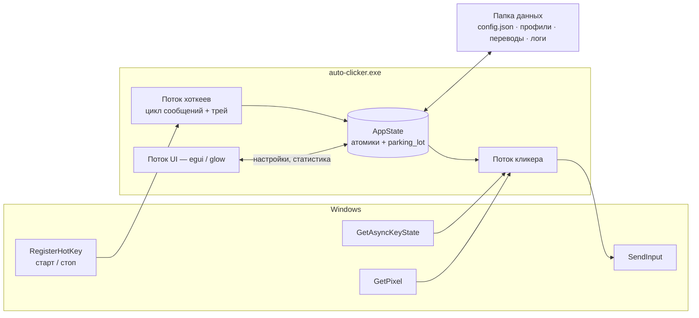
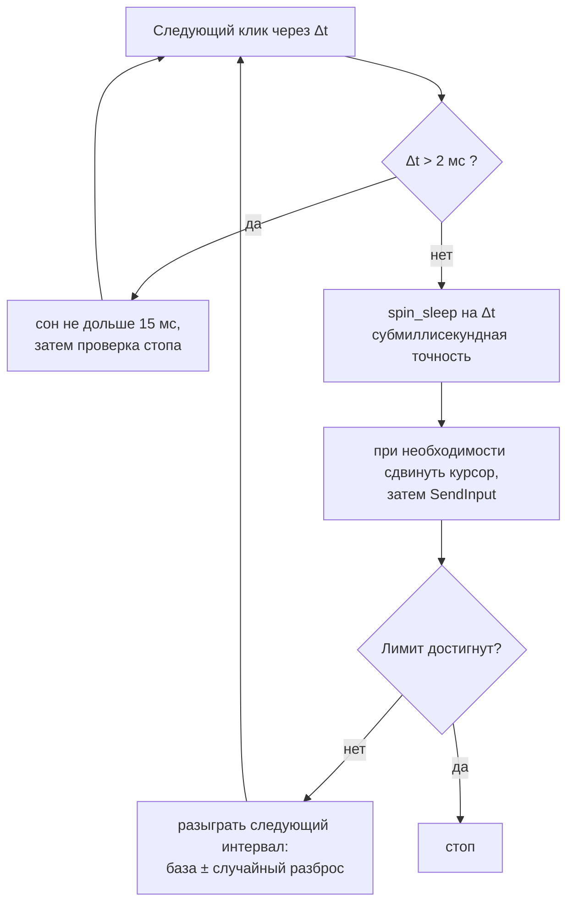

<div align="center">


# 🖱 Auto Clicker

**Открытый аналог OP Auto Clicker — на Rust.**
*Та же раскладка, к которой вы привыкли, плюс всё, чего в ней не хватало.*

[](LICENSE)
[]()
[]()
[]()
[]()

*Задал интервал → выбрал кнопку → нажал `F6` → пошёл заниматься своими делами.*

[📥 Скачать](../../releases) • [✨ Возможности](#-возможности) • [🆚 vs OP Auto Clicker](#-auto-clicker-vs-op-auto-clicker) • [🧠 Как это работает](#-как-это-работает) • [🇬🇧 English version](README.md)

img src="screenshot1.png" width="330" alt="Окно Auto Clicker">

</div>

---

## 🆕 Коротко о главном

| | |
|---|---|
| ⏱ **Привычный интервал** | Часы / минуты / секунды / миллисекунды и необязательный случайный разброс ± — значения по умолчанию как у OP Auto Clicker |
| ⌨ **Режим клавиатуры** | Повторяет *клавишу*, а не клик, по тому же расписанию. Отправляется скан-кодом, поэтому её видят игры на raw input |
| 🔫 **Клик по удержанию** | Клавиша старта превращается в гашетку: клики идут, только пока вы её держите |
| 📍 **Список точек** | Обходит по кругу сколько угодно точек экрана, а не одну |
| 🎲 **Разброс в пикселях** | Случайное смещение вокруг цели — клики перестают быть машинно-одинаковыми |
| 🌡 **Условие по пикселю** | Следит за пикселем экрана и останавливается, когда цвет изменился; захват с отсчётом 3 с |
| ⌛ **Лимит времени** | Остановка через Ч:М:С — вдобавок к счётчику кликов |
| 📈 **Живой CPS** | Кликов в секунду, общий счётчик и время работы |
| 🎨 **9 тем, 6 языков** | Прозрачность Mica/Acrylic, трей, профили, подключаемые переводы |
| 🔒 **Никаких глобальных хуков** | Только `RegisterHotKey` и `GetAsyncKeyState` — ничего не внедряется в чужие процессы |

---

## 📑 Содержание

- [Зачем это нужно](#-зачем-это-нужно)
- [Auto Clicker vs OP Auto Clicker](#-auto-clicker-vs-op-auto-clicker)
- [Возможности](#-возможности)
- [Как это работает](#-как-это-работает)
- [Горячие клавиши](#️-горячие-клавиши)
- [Темы](#-темы)
- [Языки](#-языки)
- [Файлы и папки](#-файлы-и-папки)
- [Скачать](#-скачать)
- [Сборка из исходников](#️-сборка-из-исходников)
- [Известные ограничения](#️-известные-ограничения)
- [FAQ](#-faq)
- [Лицензия и благодарности](#-лицензия-и-благодарности)

---

## 📖 Зачем это нужно

**OP Auto Clicker — по-настоящему хорошая программа.** Именно на неё выходит большинство, она крошечная, почти не ест процессор, а её раскладка настолько очевидна, что этот проект копирует её осознанно: интервал сверху, параметры клика, повторы, позиция курсора, крупные Старт/Стоп внизу. Если больше ничего не нужно — она отлично справится.

Меня вытолкнуло из неё всё, что *вокруг* самих кликов:

- 🔍 **Её нельзя прочитать.** Опубликованный исходный код остановился на ветке 1.x, а сборки 4.x существуют только в виде `.exe`. Программу, которая синтезирует ввод в мою систему, очень хочется иметь возможность проверить.
- 🕸 **Ситуация со скачиванием.** По запросу выпадают десятки похожих доменов, у каждого свой установщик. Настоящий проект живёт на SourceForge — а качают люди далеко не всегда его.
- 🎨 **Один фиксированный вид.** Ни тем, ни прозрачности, ни тёмного режима — а это окно висит поверх игры часами.
- 🌍 **Только английский.**
- 🎯 **Одна точка за раз.** «Фиксированная позиция» означает ровно *одну* позицию.
- ⌨ **Только мышь.** А половину времени повторять нужно как раз клавишу.

Итог: та же форма, те же значения по умолчанию, та же мышечная память — но с открытым кодом, темами, переводами и набором вещей, который превращает кликер в маленький инструмент автоматизации.

---

## 🆚 Auto Clicker vs OP Auto Clicker

> Сверено со страницей проекта на SourceForge и его же примечаниями к релизам, а не с SEO-зеркалами, которые противоречат друг другу (см. [Источники](#источники-по-колонке-op-auto-clicker)).

### Что выбрать

| Берите **OP Auto Clicker**, если… | Берите **этот**, если… |
|---|---|
| Нужен минимальный размер загрузки | Хотите читать, собирать и проверять то, что кликает за вас |
| Нужна программа, которую уже запускали миллионы | Нужны темы, прозрачность и шесть языков |
| Хватает встроенного Record & Playback | Нужны повтор клавиш, клик по удержанию или список точек |
| У вас Windows 7 или 8 | У вас Windows 10 / 11 и хочется Mica, трей и профили |

### Полное сравнение

| | **OP Auto Clicker 4.1** | **Auto Clicker** |
|---|---|---|
| **Лицензия** | Бесплатно; 4.x распространяется бинарником, опубликованный код остановился на 1.x | **MIT, исходники и есть релиз** |
| **Реализация** | Оконное приложение Windows, один портативный `.exe` | Rust 2024 + `windows-rs`, 64 бита |
| **Размер** | Маленький одиночный exe 🏆 | ≈5–6 МБ (GPU-интерфейс, 9 тем, 6 переводов) |
| **Установка** | Портативно | Портативно |
| **Поддержка Windows** | 7 / 8 / 10 / 11 🏆 | 10 / 11 |
| **Интервал кликов** | ✅ ч / м / с / мс | ✅ ч / м / с / мс, нижний предел 1 мс |
| **Случайный разброс ±** | ✅ | ✅ |
| **Кнопки мыши** | ✅ левая / правая / средняя | ✅ левая / правая / средняя **+ X1 / X2** |
| **Тип клика** | ✅ одиночный / двойной / тройной | ✅ одиночный / двойной / тройной |
| **Время удержания кнопки** | ❌ | ✅ 0–5000 мс |
| **Режим повтора клавиш** | ❌ | ✅ любая клавиша, скан-кодом |
| **Клик по удержанию** | ❌ | ✅ клавиша старта работает как гашетка |
| **N раз / бесконечно** | ✅ | ✅ |
| **Клик по текущей позиции** | ✅ | ✅ |
| **Клик по фиксированной точке** | ✅ с выбором | ✅ с отсчётом 3 с |
| **Несколько точек** | ❌ (отдельная утилита на той же странице проекта) | ✅ список без ограничений, по кругу |
| **Разброс в пикселях** | ❌ | ✅ 0–500 px вокруг цели |
| **Возврат курсора после работы** | ❌ | ✅ |
| **Остановка по лимиту времени** | ❌ | ✅ Ч : М : С |
| **Остановка по пикселю экрана** | ❌ | ✅ цвет + допуск, в обе стороны |
| **Живой CPS и счётчик кликов** | ❌ | ✅ |
| **Хоткеи работают в фоне** | ✅ | ✅ |
| **Переназначаемые хоткеи** | ✅ | ✅ нажатием любой клавиши или из списка |
| **Отдельный аварийный стоп** | ❌ | ✅ `F9` по умолчанию |
| **Сохранение настроек** | ✅ автоматически | ✅ `config.json`, по кнопке и при выходе |
| **Именованные профили** | ❌ | ✅ без ограничений |
| **Темы** | ❌ | ✅ **9**, переключаются на лету |
| **Прозрачность окна** | ❌ | ✅ пиксельная альфа + **DWM Mica / Acrylic** |
| **Языки** | Английский | **6**, на лету + автоопределение |
| **Переводы без пересборки** | ❌ | ✅ через `lang/xx.json` |
| **Трей и сворачивание в него** | ❌ | ✅ с меню старт / стоп |
| **DPI по мониторам** | не документировано | ✅ Per-Monitor v2 |
| **Запись и воспроизведение** | ✅ встроено 🏆 | ❌ — см. [соседнее приложение](#-соседнее-приложение) |
| **Ставит глобальные хуки ввода** | не документировано | **нет** — только хоткеи и опрос состояния клавиш |
| **Файл журнала** | ❌ | ✅ с ежедневной ротацией |
| **Цена** | Бесплатно | **Бесплатно навсегда** |

### В чём OP Auto Clicker всё ещё лучше 🏆

1. **Размер и охват.** Крошечный портативный exe, работающий на Windows 7. Здесь внутри GPU-рендерер и нужна современная 64-битная Windows.
2. **Встроенные запись и воспроизведение.** Одна кнопка, без второй программы. Этот проект намеренно её не дублирует.
3. **Десятилетие реального использования.** Его скачали умопомрачительное число раз. Этот проект новый, так что [пишите issues](../../issues).

### Источники по колонке OP Auto Clicker

- Страница проекта и примечания к релизам — <https://sourceforge.net/projects/orphamielautoclicker/>
- Сама загрузка 4.1 — <https://sourceforge.net/projects/orphamielautoclicker/files/4.1/>
- Ранее опубликованный код (1.x) — <https://github.com/matt81093/AutoClicker>

---

## ✨ Возможности

**Клики**

- ⏱ Интервал в часах / минутах / секундах / миллисекундах, жёсткий нижний предел 1 мс
- 🎲 Необязательный случайный разброс ±, чтобы каждый интервал был чуть другим
- 🖱 Левая, правая, средняя, **X1 и X2** кнопки; одиночный, двойной или тройной клик
- ⏳ Настраиваемое удержание — 0 мс это мгновенный тап, больше — «нажать и держать»
- ⌨ **Режим клавиатуры**: повтор любой клавиши по тому же расписанию, скан-кодом, поэтому игры на raw input её получают
- 🔫 **Клик по удержанию**: клавиша старта становится гашеткой, а не переключателем

**Куда кликать**

- 📍 Текущее положение курсора, фиксированная точка или **список точек** по кругу
- 🎯 Любая точка берётся с отсчётом 3 секунды — без ручного ввода координат
- 🎲 Разброс в пикселях вокруг цели и возврат курсора на место после остановки

**Когда останавливаться**

- 🔁 По числу кликов или «до остановки»
- ⌛ По лимиту времени Ч : М : С
- 🌡 По **условию пикселя**: когда пиксель совпал с цветом или, наоборот, перестал совпадать

**Всё остальное**

- ⌨ Переназначаемые глобальные хоткеи и отдельный аварийный стоп
- 📈 Живой CPS, общий счётчик и время работы
- 🎨 9 тем, прозрачный интерфейс, подложки Mica и Acrylic из Windows 11
- 🌍 6 языков, автоопределение и переключение на лету
- 🗂 Именованные профили, трей, «поверх всех окон», DPI по мониторам
- 📝 Файл журнала с ротацией и защита от второго запуска

---

## 🧠 Как это работает

### Архитектура



Ни `WH_KEYBOARD_LL`, ни `WH_MOUSE_LL`, никакого внедрения куда-либо: хоткеи приходят из `RegisterHotKey`, клик по удержанию опрашивает `GetAsyncKeyState` — и это вся поверхность работы с вводом.

### Цикл таймингов

`sleep()` ровно на длину интервала уплывает, а один длинный сон создаёт ощущение, что «стоп» сломан. Поэтому любое ожидание режется на куски, а последние две миллисекунды выжидаются активно:



`timeBeginPeriod(1)` запрашивается только на время работы и освобождается после — приложение не держит всю систему на таймере высокого разрешения, пока простаивает.

### Диаграмма состояний

```mermaid
stateDiagram-v2
    state "Простой" as Idle
    state "Работает" as Run
    state "Наготове" as Armed
    state "Кликает" as Click

    [*] --> Idle
    Idle --> Run: хоткей старта / кнопка «Старт»
    Run --> Idle: хоткей старта / клавиша стопа / лимит кликов
    Run --> Idle: лимит времени
    Run --> Idle: условие по пикселю
    Idle --> Armed: включён режим удержания
    Armed --> Click: клавиша зажата
    Click --> Armed: клавиша отпущена
```

---

## ⌨️ Горячие клавиши

| Действие | По умолчанию | Комментарий |
|---|---|---|
| Старт / стоп | `F6` | Как в OP Auto Clicker. Переназначается |
| Аварийный стоп | `F9` | Останавливает в любом случае |

Обе регистрируются глобально и работают, когда активно любое приложение.

Чтобы переназначить, нажмите кнопку с клавишей и затем любую клавишу — на время привязки текущие хоткеи снимаются, поэтому `F6` и `F9` можно поменять местами. Esc или 15 секунд без нажатий отменяют. Список ▾ рядом содержит клавиши, которые окно не получает вовсе: `Pause`, `ScrollLock`, NumPad.

При включённом **клике по удержанию** клавиша старта перестаёт быть переключателем и работает как гашетка: клики идут, только пока она физически зажата.

> Если комбинацию уже заняла другая программа, приложение скажет об этом в разделе **⌨ Горячие клавиши**, а не промолчит.

---

## 🎨 Темы

| № | Тема | Комментарий |
|---|---|---|
| 0 | **Dark** | По умолчанию. Нейтральные серые, зелёный акцент |
| 1 | **OLED (Pure Black)** | Панели `#000000` — чёрные пиксели реально выключены |
| 2 | **Material Design 3** | Скруглённые элементы; **берёт цвет акцента Windows** |
| 3 | **Catppuccin Mocha** | Пастельная классика |
| 4 | **Nord** | Холодные арктические синие |
| 5 | **Dracula** | Тёмно-серый с ярко-зелёным акцентом |
| 6 | **Glassmorphism** | Полупрозрачные панели + **DWM Acrylic** |
| 7 | **Neumorphism** | Единственная светлая тема — мягкие тени |
| 8 | **Fluent (Mica)** | Подложка **Mica** из Windows 11 + системный акцент |

Галочка **«Прозрачный интерфейс»** работает поверх любой темы. Выпадающие списки и меню всегда остаются непрозрачными: просвечивающий список поверх собственного интерфейса читать невозможно.

---

## 🌍 Языки

`English` · `Русский` · `Українська` · `Português` · `Español` · `中文`

Определяется через `GetUserDefaultUILanguage()` при первом запуске и меняется в любой момент без перезапуска. Кнопка **«Выгрузить шаблон перевода»** создаёт `lang/xx.template.json` — плоский список всех строк. Переведите значения, переименуйте в `lang/xx.json`, перезапустите — и ваши строки заменят встроенные. Отсутствующие ключи и пустые значения берутся из значений по умолчанию, так что частичный перевод — это нормально.

---

## 📁 Файлы и папки

Папка данных выбирается при старте и показывается внизу окна:

1. **Рядом с исполняемым файлом**, если туда можно писать — полностью портативно;
2. иначе **`%APPDATA%\AutoClicker\`**, чтобы работало и из `Program Files`.

```
<папка данных>/
├── config.json                  настройки
├── profiles/
│   └── farming.json             именованные профили
├── lang/
│   └── ru.json                  необязательные переопределения перевода
└── logs/
    └── auto-clicker.log.YYYY-MM-DD
```

### `config.json`

| Ключ | Тип | По умолчанию | Значение |
|---|---|---|---|
| `interval_h` / `_m` / `_s` / `_ms` | u64 | `0/0/0/100` | Интервал между кликами |
| `random_offset_enabled` / `random_offset_ms` | bool / u64 | `false` / `40` | Симметричный разброс ± интервала |
| `action_mode` | 0/1 | `0` | `0` кнопка мыши · `1` клавиша |
| `mouse_button` | 0–4 | `0` | левая · правая · средняя · X1 · X2 |
| `click_type` | 0–2 | `0` | одиночный · двойной · тройной |
| `hold_ms` | 0–5000 | `0` | Сколько кнопка остаётся нажатой |
| `key_vk` | u32 | `32` | Код клавиши для режима клавиатуры |
| `repeat_infinite` / `repeat_times` | bool / u64 | `true` / `1` | До остановки или фиксированное число |
| `position_mode` | 0–2 | `0` | текущая · фиксированная точка · список точек |
| `pos_x` / `pos_y` | i32 | `0` | Фиксированная цель |
| `points` | массив | `[]` | `[[x, y], …]`, обходятся по кругу |
| `jitter_px` | 0–500 | `0` | Случайный разброс вокруг цели |
| `return_cursor` | bool | `false` | Возвращать курсор после остановки |
| `limit_enabled` + `limit_h` / `_m` / `_s` | bool + u64 | `false` | Остановиться через это время |
| `pixel_enabled` | bool | `false` | Останавливаться по пикселю экрана |
| `pixel_x` / `pixel_y` | i32 | `0` | Отслеживаемая координата |
| `pixel_r` / `_g` / `_b` | u8 | `255,0,0` | Целевой цвет |
| `pixel_tolerance` | 0–255 | `20` | Допуск на канал |
| `pixel_mode` | 0/1 | `0` | `0` стоп при совпадении · `1` при расхождении |
| `hotkey_toggle` / `hotkey_stop` | объект | F6 / F9 | `{ "vk": 117, "ctrl": false, "alt": false, "shift": false }` |
| `hold_mode` | bool | `false` | Клавиша старта становится гашеткой |
| `default_lang` | 0–6 | `0` | `0` авто, далее EN, RU, UK, PT, ES, ZH |
| `default_theme` | 0–8 | `0` | Индекс из таблицы тем |
| `transparent_ui` / `always_on_top` | bool | `true` | Вид окна и его положение |
| `tray_enabled` / `close_to_tray` | bool | `true` / `true` | Значок в трее; ✕ сворачивает вместо выхода |

Значения вне диапазона обрезаются, а отсутствующие ключи берутся из значений по умолчанию — старый конфиг продолжает работать.

---

## 📥 Скачать

Берите свежий `.exe` со страницы **[Releases](../../releases)**. Установка не нужна.

| Файл | Требования | Комментарий |
|---|---|---|
| `AutoClicker.exe` | Любой x86-64 CPU | Универсальный — работает везде |
| `AutoClicker.v3.exe` | CPU с AVX2 (Intel Haswell 2013+ / AMD Zen+) | Чуть быстрее на современных процессорах |

> ⚠️ **Про антивирусы:** всё, что синтезирует ввод мыши и клавиатуры, выглядит для сканера подозрительно, а неподписанные сборки помечаются особенно охотно. Это ложное срабатывание, которое касается всей категории. Именно поэтому исходники здесь: [соберите сами](#️-сборка-из-исходников) и доверяйте своему бинарнику.

---

## 🛠️ Сборка из исходников

```bash
# 1. Установите Rust (1.97.1+, edition 2024): https://rustup.rs
# 2. Клонируйте и соберите
git clone https://github.com/blackixxce12/autoclicker-git
cd auto-clicker

# Универсальная сборка
cargo build --release

# Оптимизированная сборка (AVX2)
# CMD:
set RUSTFLAGS=-C target-cpu=x86-64-v3 && cargo build --release
# PowerShell:
$env:RUSTFLAGS="-C target-cpu=x86-64-v3"; cargo build --release

# Тесты (математика интервалов, обрезка значений, границы разброса, переводы)
cargo test
```

Бинарник появится в `target/release/`. Release-профиль: `opt-level = "z"`, полный LTO, один codegen unit, символы вырезаны, `panic = "abort"`.

**Иконка:** `build.rs` встраивает `assets/icon.ico` через [`winresource`](https://github.com/BenjaminRi/winresource), которому нужен компилятор ресурсов — `rc.exe` (Windows SDK, идёт с MSVC-тулчейном) или `windres.exe` (MinGW). Если его нет, сборка всё равно проходит: будет `cargo:warning` и не будет иконки в проводнике. Иконка окна берётся из `assets/icon.rgba` и работает всегда.

---

## ⚠️ Известные ограничения

| Ограничение | Подробности |
|---|---|
| **Только Windows** | Всё идёт через Win32. Другие цели компилируются, но ничего не делают |
| **Нет записи и воспроизведения** | Намеренно — это отдельное приложение, см. ниже |
| **Экранные абсолютные координаты** | Фиксированные точки рассчитывают на ту же раскладку экрана, что при их выборе |
| **Окна с повышенными правами** | Windows блокирует синтетический ввод в окна с более высокими привилегиями. Если цель запущена от админа — запускайте и кликер от админа |
| **Античиты** | `SendInput` — стандартный синтетический ввод. Многие игры его принимают, но античит уровня ядра может его обнаружить или заблокировать. Случайный разброс помогает выглядеть менее машинно, но обходить защиту здесь ничто не предназначено |
| **Очень короткие интервалы** | Нижний предел 1 мс. Меньше ~10 мс приложение предупреждает: на такой скорости работать за машиной тяжело, держите `F9` под рукой |

---

## ❓ FAQ

**Меня забанят за это?**
Возможно. Многие игры и сервисы запрещают автоматизацию в правилах пользования, а некоторые за это наказывают. Читайте правила того, что автоматизируете — решение ваше, а не инструмента.

**Почему здесь не нужны хуки, а другим кликерам нужны?**
Потому что кликеру нужно только *отправлять* ввод, а не наблюдать за ним. Хоткеи приходят из `RegisterHotKey`, а клик по удержанию опрашивает аппаратное состояние клавиши. Ничего не внедряется в чужие процессы — это и проще, и спокойнее для антивирусов.

**Какая максимальная скорость?**
Нижний предел интервала — 1 мс, то есть теоретически около 1000 кликов в секунду; на практике целевое приложение упирается гораздо раньше. Живой счётчик CPS показывает, что получается на самом деле.

**Будет ли кликать в полноэкранной игре?**
Лучше всего — в безрамочном/оконно-полноэкранном режиме. Эксклюзивный полный экран и игры на raw input могут вести себя нестабильно, как и с любым инструментом на `SendInput`. Режим клавиатуры отправляет скан-коды, и их такие игры принимают гораздо охотнее.

**Куда делись мои настройки?**
Они рядом с exe, если туда можно писать, иначе в `%APPDATA%\AutoClicker\`. Точный путь напечатан внизу окна.

**Двойной клик выбран, а двойного клика нет?**
Пауза между двумя нажатиями зафиксирована на 30 мс, чтобы Windows считала их одним двойным кликом. Если целевая программа всё равно видит два одиночных — значит, у неё свои правила по таймингам.

---

## 📜 Лицензия и благодарности

MIT — см. [LICENSE](LICENSE). Делайте что хотите; ссылка обратно приветствуется.

- **OP Auto Clicker** (Orphamiel Auto-Clicker) — раскладка, которую этот проект заимствует, и планка, на которую он равняется.
- [`egui` / `eframe`](https://github.com/emilk/egui) — immediate-mode GUI, на котором держатся 9 тем.
- [`windows-rs`](https://github.com/microsoft/windows-rs) — официальные Rust-биндинги к Win32 API.
- [`spin_sleep`](https://github.com/alexheretic/spin-sleep) — причина, по которой интервалы скучно-точны.
- [`tracing`](https://github.com/tokio-rs/tracing), [`winresource`](https://github.com/BenjaminRi/winresource) — логи и иконка исполняемого файла.

<div align="center">

**Если это спасло ваш палец — поставьте ⭐.**

</div>
